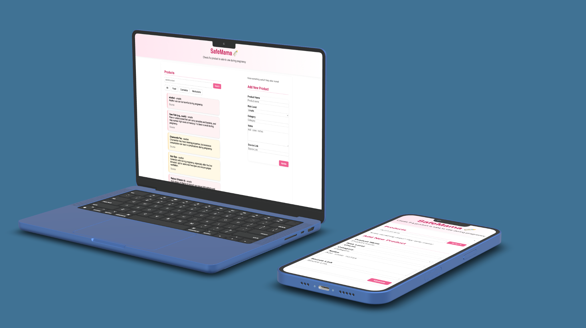

# safemama
Web app to check product safety during pregnancy

## Description

SafeMama is a simple web application that helps pregnant women verify whether a product is safe to eat, drink, or use during pregnancy.  
Users can search for a product and see its safety level: **safe**, **unsafe**, or **caution**.  
Each product includes a short explanation and a link to a reliable source.

The goal is to provide clear, useful information—especially in moments when everyday products may cause doubts.  
The app starts with a small database of 10 products. If there's time, categories (like food, medicine, cosmetics) and other features could be added later.

---

## Tech Stack

- **Frontend**: React, Vite, CSS
- **Backend**: Node.js, Express
- **Database**: MongoDB, with Mongoose ODM
- **Language**: JavaScript (ES Modules)
- **Other**: dotenv, cors

---


## How to run the project locally

```bash
git clone https://github.com/MVictoriaDoll/safemama.git
cd safemama

2. Create a .env file for the backend
In the /server folder, create a file named .env with this content: MONGO_URI=mongodb://localhost:27017/safemama

3. Install and run the backend
cd server
npm install
npm run dev

4. In a new terminal, install and run the frontend
cd ../client
npm install
npm run dev
```

---

## Project Structure

```
safemama/
├── client/    
├── server/     
└── README.md
```

---

## Author

@MVictoriaDoll

---

## Notes

Make sure MongoDB is running locally before starting the backend.

The app loads an initial set of products. You can edit or expand this data from the backend.

To use MongoDB Atlas instead of local DB, replace the MONGO_URI with your own connection string.

---

;
